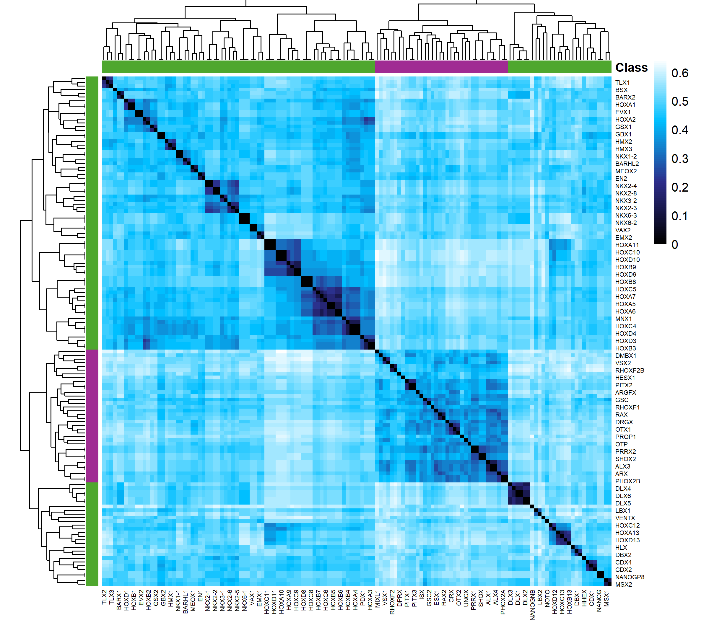

```{r setup, include=FALSE}
knitr::opts_chunk$set(echo = TRUE)
knitr::opts_chunk$set(warning = FALSE, 
                      message = FALSE, 
                      error = TRUE, 
                      fig.width = 10) 
```


```{r, echo = FALSE}
library("msa")
library("ape")
library("seqinr")
library("ggplot2")
library("tidyr")
library("stringr")
library("readxl")
library("biomaRt")
library("pheatmap")
library("bios2mds")
library("ggseqlogo")
library("dplyr")
library("plotly")
library("cowplot")
library("viridis")
library("ggdendro")
```

# Goals

1. Compare sequence conservation across all homeodomain transcription factors. 

2. Determine if there are residues specific to Paired-like homeodomains.


# Define subclass families

## Compile necessary data

1. Read in all sequence information associated with "homeobox" from [Uniprot](https://www.uniprot.org/) (mySequence). *344 TFs*

2. Grab list of all homeodomains from [CISBP](http://cisbp.ccbr.utoronto.ca/) and to ensure that we have all of the homeodomains from CISBP. CISBP also has a stronger curation than uniprot since it is based on DNA binding information instead of just sequence conservation. *229 TFs* 

3. Import information on DNA binding domain location from [Uniprot](https://www.uniprot.org/).

</br>


**Note: ** A manual entry has been added for the Drosophila Paired factor used in the Paired-dimer on DNA structure (1FJL). The S50Q mutation has been made to the entry!

```{r}
## Read in all entries of uniprot
mySequence <- readAAStringSet("All_HDs.fasta")

mySequence

## Read in all homeodomains from CISBP
HDlist <- read.delim("CISBP_HDs.csv", 
                     sep = ",") %>%
  filter(Species == "Homo_sapiens")

head(HDlist)

HD <- HDlist$Name %>% gsub("\\.", "-", .)


## Read in DNA binding domain mapping information from Uniprot
DBDlist <- read_excel("DBD_information.xlsx") %>%
  dplyr::select(Gene_name, DBD_start, DBD_end)

head(DBDlist)

```


**Combine all databases together.**

```{r}

df <- data.frame("TF_tmp" = names(mySequence), 
                 "seq" = as.character(mySequence, use.names = FALSE)) %>%
  separate(TF_tmp, into = c("x1", "TF_tmp2"), sep = " GN=" ) %>%
  separate(TF_tmp2, into = c("TF"), sep = " ") %>%
  dplyr::select(-x1) %>%
  filter(TF %in% HD) %>%
  merge(., DBDlist, by.x = "TF", by.y = "Gene_name", all.x = TRUE) 

df$DBD_start <- as.numeric(df$DBD_start)
df$DBD_end <- as.numeric(df$DBD_end)

```

*Sanity checks: *

1. Do all HDs have DNA binding domain starts and ends?

2. Check DNA binding domain lengths. Are they what we would expect?

3. If the DNA binding domain lengths are not the correct length, ensure that we have the proper homeodomain.

```{r}


df %>% filter(is.na(DBD_start))
df %>% filter(is.na(DBD_end))

df %>% 
  mutate(DBD_length = DBD_end - DBD_start +1) %>% 
  group_by(DBD_length) %>%
  summarise(Count = n()) %>%
  ggplot(aes(x = as.factor(DBD_length), y = Count, label = Count)) + 
  geom_bar(stat = "identity") + 
  geom_text(vjust = -1, size = 5) + 
  xlab("DBD length") + 
  ylab("Number of HDs") + 
  theme_classic() + 
  ylim(c(0, 220)) + 
  theme(text = element_text(size = 20))

df %>% 
  mutate(length = DBD_end - DBD_start +1) %>% 
  filter(! (length %in% c(60:64))) %>%
  dplyr::select(TF, length)


```

<br>


Most entries now have an homeobox-*like* DNA binding domain associated with them. These have been removed on this current version to accommodate the bit information part of this analysis!

## DNA binding domain clustering


### All class

```{r, fig.width = 11, fig.height = 10}

Family <- read_excel("Family_annotation.xlsx") %>% as.data.frame()
rownames(Family) <- Family$TF
Family <- dplyr::select(Family, -TF)

Family$TF = rownames(Family)

dfDBD <- df %>% mutate(seqDBD = subseq(seq, start = DBD_start, end = DBD_end)) %>%
  group_by(TF) %>%
  add_count() %>%
  arrange(DBD_start) %>%
  mutate(HDnum = row_number()) %>%
  mutate(TF = case_when(n > 1 ~ paste(TF, HDnum, sep = "_"), 
                        TRUE ~ TF)) %>%
  dplyr::select(-c(n, HDnum)) %>%
  merge(., Family)
#filter(Class == "ANTP")


AA <- AAStringSet(dfDBD %>% .$seqDBD)
names(AA) <- dfDBD %>% .$TF

myAlignment <- msa(AA)


myAlignment4tree <- msaConvert(myAlignment, type="seqinr::alignment")
distances <- dist.alignment(myAlignment4tree, "similarity", gap = TRUE)

anncolor = list(Class = c(`Paired-like`="#A02B93", 
                          `ANTP`="#4EA72E", 
                          `ATYPICAL`=mako(7)[1], 
                          `CUT`=mako(7)[2], 
                          `LIM`=mako(7)[3], 
                          `PAIRED`=mako(7)[4], 
                          `POU`=mako(7)[5], 
                          `TALE`=mako(7)[6], 
                          `ZF`=mako(7)[7]))

pheatmap(distances %>% as.matrix(), 
         cluster_rows = TRUE, 
         color = colorRampPalette(colors = c("black", "darkblue", "deepskyblue", "white"))(100), 
         drop_levels = FALSE, 
         show_rownames = FALSE, 
         show_colnames = FALSE,
         annotation_row = Family %>% select(-TF, -Subclass),
         annotation_col = Family %>% select(-TF, -Subclass),
         width = 8, 
         height = 7, 
         method = "complete",
         angle_col = 90, 
         border_color = NA,
         annotation_colors = anncolor,
         annotation_legend = TRUE)


```

### Just Paired-like and ANTP

As the ANTP and Paired-like classes cluster together and these classes typically only have a single DNA binding domain, continue with only these classes.

Filter for 60 amino acid DNA binding domains 

```{r, fig.width = 12, fig.height = 11}


dfDBD <- df %>% mutate(seqDBD = subseq(seq, start = DBD_start, end = DBD_end)) %>%
  group_by(TF) %>%
  add_count() %>%
  arrange(DBD_start) %>%
  mutate(HDnum = row_number()) %>%
  mutate(TF = case_when(n > 1 ~ paste(TF, HDnum, sep = "_"), 
                        TRUE ~ TF)) %>%
  dplyr::select(-c(n, HDnum)) %>%
  merge(., Family) %>%
  filter(Class %in% c("ANTP", "Paired-like")) %>%
  filter(DBD_end - DBD_start == 59)


AA <- AAStringSet(dfDBD %>% filter(Class %in% c("ANTP", "Paired-like")) %>% .$seqDBD)
names(AA) <- dfDBD %>% filter(Class %in% c("ANTP", "Paired-like")) %>% .$TF

myAlignment <- msa(AA)

myAlignment4tree <- msaConvert(myAlignment, type="seqinr::alignment")
distances <- dist.alignment(myAlignment4tree, "similarity", gap = TRUE)

tmp <- hclust(distances %>% as.dist())

annot_df <- data.frame(TF = tmp$labels, 
                       Index = c(1:138)) %>%
  mutate(Class = case_when(Index %in% c(1:36) ~ "Paired-like", 
                           TRUE ~ "ANTP")) %>%
  mutate(Class = factor(Class))

rownames(annot_df) <- annot_df$TF

annot_df <- annot_df %>% select(Class)

anncolor = list(Class = c(`Paired-like`="#A02B93", `ANTP`="#4EA72E"))


g <- pheatmap(distances %>% as.matrix(), 
              cluster_rows = TRUE, 
              color = colorRampPalette(colors = c("black", "#2D2D8A", "deepskyblue", "white"))(100), 
              drop_levels = FALSE, 
              show_rownames = TRUE, 
              show_colnames = TRUE, 
              width = 14, 
              cellwidth = 5, 
              cellheight = 5,
              border_color = NA,
              height = 12,
              filename = "DBD_heatmap.png",
              method = "complete",
              angle_col = 90,
              annotation = annot_df,
              annotation_row = annot_df,
              annotation_names_row = FALSE, 
              annoation_names_col = FALSE,
              annotation_colors = anncolor, 
              # annotation_legend = FALSE, 
              legend = TRUE, 
              fontsize_row = 5, 
              fontsize_col = 5)

genesInHeatOrder_v <- g$tree_row$labels[g$tree_row$order]
Odd <- genesInHeatOrder_v[c(TRUE, FALSE)]
Even <- genesInHeatOrder_v[c(FALSE, TRUE)]

labs.row <- rownames(distances %>% 
                       as.matrix())
labs.col <- colnames(distances %>% 
                       as.matrix())

labs.row[labs.row %in% Odd] <- ""

labs.col[labs.col %in% Even] <- ""

pheatmap(distances %>% as.matrix(), 
         cluster_rows = TRUE, 
         color = colorRampPalette(colors = c("black", "#2D2D8A", "deepskyblue", "white"))(100), 
         drop_levels = FALSE, 
         show_rownames = TRUE, 
         show_colnames = TRUE, 
         width = 8, 
         height = 7,  
         cellwidth = 3, 
         cellheight = 3,
         border_color = NA,
         method = "complete",
         angle_col = 90,
         annotation = annot_df,
         file = "DBD_heatmap.png",
         annotation_row = annot_df,
         annotation_names_row = FALSE, 
         annoation_names_col = FALSE,
         annotation_colors = anncolor, 
         annotation_legend = FALSE, 
         legend = TRUE, 
         fontsize_row = 5, 
         fontsize_col = 5,
         labels_row = labs.row,
         labels_col = labs.col) %>% print()


```


### Paired-like cladogram

```{r, fig.width = 4, fig.height = 8, results = 'hide'}

flank = params$flank

Family$TF = rownames(Family)

dfDBD_PairedL <- df %>% mutate(seqDBD = subseq(seq, start = DBD_start, end = DBD_end)) %>%
  group_by(TF) %>%
  add_count() %>%
  arrange(DBD_start) %>%
  mutate(HDnum = row_number()) %>%
  mutate(TF = case_when(n > 1 ~ paste(TF, HDnum, sep = "_"), 
                        TRUE ~ TF)) %>%
  dplyr::select(-c(n, HDnum)) %>%
  merge(., Family) %>%
  filter(Class == "Paired-like") %>%
  filter(DBD_end - DBD_start == 59)


AA <- AAStringSet(dfDBD_PairedL$seqDBD)
names(AA) <- dfDBD_PairedL$TF

myAlignment <- msa(AA)

myAlignment4tree <- msaConvert(myAlignment, type="seqinr::alignment")
distances <- dist.alignment(myAlignment4tree, "similarity", gap = TRUE)

tmp <- hclust(distances %>% as.dist())


tmp <- dendro_data(tmp, type = "rectangle")
tested <- c("PHOX2B", "ARX", "RAX2", "PROP1", "ALX4", "SHOX", "VSX1", "PRRX1", "GSC", "ESX1", "CRX", "OTP", "ISX", "OTX2", "PITX3")

tmp$labels$tested <- (tmp$labels$label %in% tested)

ggplot() + 
  geom_segment(data = tmp$segments, aes(x = x, y = y, xend = xend, yend = yend)) + 
  coord_flip() + 
  scale_y_reverse(expand = expansion(mult = c(0,0.6))) + 
  geom_text(data = tmp$labels, 
            aes(x = x, y = y-0.05, label = label, 
                color = tested), vjust = 0.5, size = 5, hjust = 0, show.legend = FALSE) + 
  scale_color_manual(values = c("darkgray", "#A02B93")) + 
  theme_dendro() 


```

### Family breakdown

```{r}

Family %>% 
  group_by(Class, Subclass) %>% 
  summarise(Count = n()) %>% 
  ggplot(aes(x = Subclass, y = Count, label = Count)) + 
  geom_col(width = 0.8, fill = "lightblue") + 
  facet_grid(~Class, scale = "free", space = "free") + 
  theme_gray() + 
  geom_text(vjust = -1, size = 5) + 
  scale_y_continuous(expand = expansion(mult = c(0, 0.2))) + 
  theme_bw() + 
  theme(text = element_text(size = 20), 
        axis.text.x = element_text(angle = 45, vjust = 1, hjust = 1))

```

# Residue composition of classes

### Define function to create sequence logos

The below function filters the DNA binding domain sequences by the given class/subclass/cooperativity status. It runs a multiple sequence alignment to match up sequences based on position. Due to transitions in formatting, I had to convert the msa to the bios2mds package to export the alignment. I then imported the alignment to pipe into the geom_logo plotting feature. 

```{r, fig.height = 3.11, fig.width = 11.44, results = 'hide'}

namespace <- matrix(data = c( "R",	"Basic",	"#255C99",
                              "H",	"Basic",	"#255C99",
                              "K",	"Basic",	"#255C99",
                              "D",	"Acidic",	"#D62839",
                              "E",	"Acidic",	"#D62839",
                              "S",	"Polar",	"#109648",
                              "T",	"Polar",	"#109648",
                              "N",	"Polar",	"#109648",
                              "Q",	"Polar",	"#109648",
                              "C",	"Special",	"#5E239D",
                              "G",	"Special",	"#5E239D",
                              "P",	"Special",	"#5E239D",
                              "A",	"Hydrophobic",	"#000000",
                              "V",	"Hydrophobic",	"#000000",
                              "I",	"Hydrophobic",	"#000000",
                              "L",	"Hydrophobic",	"#000000",
                              "M",	"Hydrophobic",	"#000000",
                              "F",	"Hydrophobic",	"#000000",
                              "Y",	"Hydrophobic",	"#000000",
                              "W",	"Hydrophobic",	"#000000", 
                              "o", "Empty", "gray"), 
                    ncol = 3, byrow = TRUE) %>% 
  as.data.frame()

colnames(namespace) <- c("Residue", "Type", "Color")

col_scheme <- make_col_scheme(chars = namespace$Residue, 
                              groups = namespace$Type, 
                              cols = namespace$Color)


H <- data.frame(xmin = c(9.5, 27.5, 41.5), 
                xmax = c(22.5, 37.5, 56.5), 
                ymin = c(0,0,0), 
                ymax = c(4.5,4.5,4.5))

DifferentialAlign2seq <- function(data, column, filter1, filter2 = NA, norm = TRUE, tile = FALSE) {
  
  lower_range = 0 %>% as.character()
  outer_range = 60 %>% as.character()
  
  group1 <- filter(data, !!rlang::sym(column) == filter1) %>%
    .$seqDBD %>%
    AAStringSet(.)
  
  plot1 <- ggplot() +
    geom_logo(group1 %>% as.data.frame(),
              stack_width = 0.75,
              namespace = namespace$Residue,
              col_scheme = col_scheme,
              seq_type = "other") +
    theme_logo() +
    theme(text = element_text(size = 32),
          legend.position = "none", 
          plot.title = element_text(size = 28)) +
    scale_x_continuous(labels = seq(from = 5, by = 5, to = 60), 
                       breaks = seq(from = 5, by = 5, to = 60), 
                       expand = c(0,0), 
                       limits = c(0.5, 60.5)) + 
    ggtitle(paste(filter1, " (n = ", length(group1), ")", sep = "")) + 
    geom_rect(data = H, aes(xmin = xmin, xmax = xmax, ymin = ymin, ymax = ymax), 
              color = "lightgray",
              alpha = 0.1) + 
    ylim(c(0,4.5))
  
  if (is.na(filter2)) {
    
    gridExtra::grid.arrange(plot1)
    
  }
  
  else {
    
    group2 <- data %>%
      filter(!!rlang::sym(column) == filter2) %>%
      .$seqDBD %>%
      AAStringSet(.)
    
    
    plot2 <- ggplot() +
      geom_logo(group2 %>% as.data.frame(),
                stack_width = 0.75,
                namespace = namespace$Residue,
                col_scheme = col_scheme,
                seq_type = "other") +
      theme_logo() +
      theme(text = element_text(size = 32),
            legend.position = "none") +
      scale_x_continuous(labels = seq(from = 2, by = 2, to = 60), 
                         breaks = seq(from = 2, by = 2, to = 60), 
                         expand = c(0,0), 
                         limits = c(0.5, 60.5)) + 
      ggtitle(paste(filter2, " (n = ", length(group2), ")", sep = "")) + 
      geom_rect(data = H, aes(xmin = xmin, xmax = xmax, ymin = ymin, ymax = ymax), 
                color = "lightgray",
                alpha = 0.1) + 
      ylim(c(0,4.5))
    
    
    g1 <- geom_logo(group1 %>% as.data.frame(), plot = FALSE) %>%
      group_by(position, letter) %>%
      mutate(group = "GROUP1")
    
    g2 <- geom_logo(group2 %>% as.data.frame(), plot = FALSE) %>%
      group_by(position, letter) %>%
      mutate(group ="GROUP2")
    
    g <- rbind(g1, g2) %>%
      group_by(position, letter, group) %>%
      summarise(y = mean(y)) %>%
      pivot_wider(names_from = "group", values_from = y)
    
    
    if (norm == TRUE) {
      max_GROUP1 <- max(g$GROUP1, na.rm = TRUE)
      max_GROUP2 <- max(g$GROUP2, na.rm = TRUE)
      
      diff <- max_GROUP2 - max_GROUP1
    } else {
      diff = 0
    }
    
    tot <- g %>%
      group_by(position) %>%
      summarize(count = n())
    
    l <- merge(tot, g, all.y = TRUE, by = "position") %>%
      mutate(GROUP2 = case_when(GROUP2 > 0 ~ GROUP2 - (diff / count),
                                GROUP2 ==0 ~ GROUP2)) %>%
      mutate(GROUP1 = ifelse(is.na(GROUP1), 0, GROUP1)) %>%
      mutate(GROUP2 = ifelse(is.na(GROUP2), 0, GROUP2)) %>%
      mutate(y = GROUP1 - GROUP2)  %>%
      dplyr::select(-c(GROUP1, GROUP2)) %>%
      ungroup() %>%
      pivot_wider(values_from = "y", 
                  names_from = "letter", 
                  values_fill = 0) %>% 
      as.matrix() %>% 
      t()
    
    
    l <- l[-1, ]
    
    H <- data.frame(xmin = c(9.5, 27.5, 41.5), 
                    xmax = c(22.5, 37.5, 56.5), 
                    ymin = c(-4,-4,-4), 
                    ymax = c(4,4,4))
    
    plot3 <- ggplot() +
      geom_hline(yintercept = 0,
                 # linetype = "longdash",
                 color = "gray",
                 linewidth = 0.5) +
      geom_logo(l, method = "custom",
                stack_width = 0.75,
                namespace = namespace,
                col_scheme = col_scheme,
                seq_type = "other") +
      theme_logo() +
      theme(text = element_text(size = 32),
            legend.position = "none", 
            axis.ticks.length = unit(0, "pt"), 
            plot.title = element_text(size = 28)) +
      scale_x_continuous(labels = seq(from = 5, by = 5, to = 60), 
                         breaks = seq(from = 5, by = 5, to = 60), 
                         expand = c(0,0), 
                         limits = c(0.5, 60.5)) + 
      scale_y_continuous(labels = c(-4, -2, 0, 2, 4), 
                         breaks = c(-4, -2, 0, 2, 4), 
                         limits = c(-4,4)) +
      ggtitle("Differential bit analysis") + 
      ylab(expression(paste(Delta, "Bit"))) +
      ylim(c(-4, 4))
    
    if ( tile == TRUE ) {   
      
      plot4 <- 
        data %>% 
        filter( (!!rlang::sym(column) == filter1)  | (!!rlang::sym(column) == filter2) ) %>%
        separate(seqDBD, into = ( c(0:60) %>% as.character() ), sep = "") %>% 
        dplyr::select(-c("0")) %>%
        pivot_longer(( c(1:60) %>% as.character() ),
                     names_to = "Position",
                     values_to = "Residue") %>%
        merge(., namespace) %>%
        mutate(Position = as.numeric(Position)) %>%
        ggplot(aes(x = Position,
                   y = reorder(TF, desc(!!rlang::sym(column))),
                   label = Residue,
                   color = Type)) +
        geom_text(size = 4) +
        theme_classic() +
        theme(legend.position = "bottom",
              axis.title.y = element_blank(),
              plot.margin = unit(c(-0.4,0,0,0), "cm"),
              text = element_text(size = 32,
                                  color = "black"), 
              plot.title = element_text(size = 28)) +
        scale_color_manual(values = namespace$Color,
                           breaks = namespace$Type) + 
        scale_x_continuous(labels = seq(from = 1, by = 3, to = 60), 
                           breaks = seq(from = 1, by = 3, to = 60), 
                           limits = c(0.5, 60.5), 
                           expand = c(0,0)) + 
        geom_hline(yintercept = 10.5, 
                   lty = "dashed")
      
      plot3 <- plot3 +
        theme(axis.title.x = element_blank(),
              text = element_text(size = 16,
                                  color = "black"),
              plot.margin = unit(c(0,0,0,0), "cm"),
              plot.title = element_blank()) 
      
      gA <- ggplotGrob(plot3)
      gB <- ggplotGrob(plot4)
      maxWidth = grid::unit.pmax(gA$widths[2:5], gB$widths[2:5])
      gA$widths[2:5] <- as.list(maxWidth)
      gB$widths[2:5] <- as.list(maxWidth)
      gridExtra::grid.arrange(gA, gB, ncol = 1, heights = c(5, 20))
      
      gridExtra::grid.arrange(plot3, plot4, heights = c(5, 20),
                              ncol = 1, nrow = 2)
      
    }
    else 
    {
      
      # gridExtra::grid.arrange(plot1, plot2, plot3)
      plot3
    }
  }
}

```


## Residue composition of subclasses in ANTP

```{r, results = 'hide', fig.show = FALSE, echo = FALSE, fig.keep = "none", fig.height=15, fig.width = 15}

plot1 <- DifferentialAlign2seq(data = dfDBD, column = "Class", filter1 = "Paired-like")
plot2 <- DifferentialAlign2seq(data = dfDBD, column = "Class", filter1 = "ANTP")
plot3 <- dfDBD %>% filter(Class %in% c("ANTP", "Paired-like")) %>%
  DifferentialAlign2seq(data = ., column = "Class", filter2 = "ANTP", filter1 = "Paired-like") 


plot_grid(plot1, plot2, plot3, align = "hv", axis = "tblr", nrow = 3, rel_heights = c(1,1,1.5))

```

## Interrogate specific positions

```{r}

residueDistribution <- function(data, ClassGroups, DBDPosition){
  
  data %>% 
    filter(Class %in% ClassGroups) %>% 
    dplyr::select(-seq) %>% 
    separate(seqDBD, into = c(0:60) %>% as.character(), sep = "") %>% 
    pivot_longer(c(`1`:`60`), names_to = "Position", values_to = "Residue") %>% 
    merge(., namespace, by = "Residue") %>% 
    filter(Position == DBDPosition %>% as.character()) %>% 
    mutate(Residue = factor(Residue, levels = namespace$Residue, ordered = TRUE)) %>%
    group_by(Class, Type, Residue) %>% 
    summarize(Count = n()) %>% 
    ggplot(aes(x = Residue, 
               y = Count, 
               fill = Type,
               color = Type,
               label = Count)) + 
    geom_col(show.legend = FALSE, 
             alpha = 0.6) + 
    geom_text(vjust = -1, 
              color = "black", 
              size = 5) +
    facet_grid(.~Class, 
               scales = "free_x", 
               space = "free",
    ) + 
    scale_y_continuous(expand = expansion(mult = c(0, 0.2))) + 
    scale_fill_manual(breaks = c("Basic", "Acidic", "Polar", "Special", "Hydrophobic", "Empty"), 
                      values = c("#255C99", "#D62839", "#109648", "#5E239D", "#000000", "gray")) + 
    scale_color_manual(breaks = c("Basic", "Acidic", "Polar", "Special", "Hydrophobic", "Empty"), 
                       values = c("#255C99", "#D62839", "#109648", "#5E239D", "#000000", "gray")) +
    xlab("Amino acid") + 
    ggtitle(paste("Position ", as.character(DBDPosition), sep = "")) + 
    theme_bw() + 
    theme(text = element_text(size = 20), 
          panel.grid = element_blank(),
          plot.title = element_text(size = 18), 
          axis.title = element_text(size = 18)
    ) 
  
}


```


```{r, fig.width = 4.7, fig.height = 4}

residueDistribution(dfDBD, c("Paired-like", "ANTP"), 26)

```


```{r, fig.width = 4.7, fig.height = 4}

residueDistribution(dfDBD, c("Paired-like", "ANTP"), 28)

```

```{r, fig.width = 4.7, fig.height = 4}

residueDistribution(dfDBD, c("Paired-like", "ANTP"), 44)

```

```{r, fig.width = 4.7, fig.height = 4}

residueDistribution(dfDBD, c("Paired-like", "ANTP"), 46)

```

# Number of reasons ANTP cannot bind cooperatively to the P3 site

## Version 1

```{r, fig.height = 4, fig.width = 15}

conflictingResidues <- 
  dfDBD %>%
  select(-seq) %>% 
  filter(Class %in% c("ANTP", "Paired-like")) %>%
  mutate(R2 = str_sub(seqDBD, start = 2, end = 2) %>%
           str_detect(., "R")) %>%
  mutate(R3 = str_sub(seqDBD, start = 3, end = 3) %>%
           str_detect(., "R")) %>%
  mutate(pos_4 = str_sub(seqDBD, start = 4, end = 4) %>%
           str_detect(., "E", negate = TRUE)) %>%
  mutate(P26 = str_sub(seqDBD, start = 26, end = 26) %>%
           str_detect(., "P")) %>%
  mutate(pos_28 = str_sub(seqDBD, start = 28, end = 28) %>%
           str_detect(., "R", negate = TRUE)) %>%
  mutate(E32 = str_sub(seqDBD, start = 32, end = 32) %>%
           str_detect(., "E")) %>%
  mutate(E42 = str_sub(seqDBD, start = 42, end = 42) %>%
           str_detect(., "E")) %>%
  mutate(pos_43 = str_sub(seqDBD, start = 43, end = 43) %>%
           str_detect(., "R", negate = TRUE)) %>%
  mutate(R44 = str_sub(seqDBD, start = 44, end = 44) %>%
           str_detect(., "Q", negate = TRUE)) %>%
  mutate(Q46 = str_sub(seqDBD, start = 46, end = 46) %>%
           str_detect(., "R|K", negate = TRUE)) %>%
  mutate(pos50 = str_sub(seqDBD, start = 50, end = 50) %>%
           str_detect("K", negate = TRUE)) %>%
  pivot_longer(c(R2:pos50), 
               names_to = "Residue", 
               values_to = "Present") %>%
  group_by(TF, Class) %>%
  summarize(Count = sum(!Present)) %>%
  arrange(Count)

conflictingResidues %>%
  ggplot(aes(y = Count, 
             x = reorder(TF, Count), 
             fill = Class)) + 
  geom_col(alpha = 0.5) + 
  ylab("Residue count") + 
  xlab("") + 
  ggtitle("Number of residues that conflict with P3 site cooperativity") + 
  scale_y_continuous(expand = c(0, 0), 
                     limits = c(0, 8.1), 
                     breaks = c(0:10)) + 
  scale_fill_manual(values = c("#A02B93", "#4EA72E"), 
                    name = "") + 
  theme_bw() + 
  theme(text = element_text(size = 15), 
        panel.grid = element_blank(), 
        axis.text.x = element_text(size = 8, angle = 90, vjust = 0.5, hjust = 1),
        axis.title.y = element_text(size = 13),
        legend.position = "bottom")

```


## Version 2

**Changes**

* If DNA binding domain is identical between two proteins, they are represented by single column.

* Columns are shaded to represent whether broken rule contributes or is critical to cooperativity. 

```{r, fig.height = 6, fig.width = 15}


dfDBDUnique <- dfDBD %>% filter(Class %in% c("ANTP", "Paired-like")) %>% distinct(., seqDBD, .keep_all = TRUE)
dfDBDMatching <- dfDBD %>% filter(Class %in% c("ANTP", "Paired-like")) %>% filter( !(TF %in% dfDBDUnique$TF) )

dfDBDConsolidated <- merge(dfDBDUnique, dfDBDMatching %>% select(TF, seqDBD), by = "seqDBD", all.x = TRUE) %>% 
  mutate(label = case_when(is.na(TF.y) ~ TF.x, TRUE ~ paste(TF.x, "/", TF.y, sep = "")))


conflictingResidues <- 
  dfDBDConsolidated %>%
  select(-seq) %>% 
  filter(Class %in% c("ANTP", "Paired-like")) %>%
  mutate(R2 = str_sub(seqDBD, start = 2, end = 2) %>%
           str_detect(., "R")) %>%
  mutate(R3 = str_sub(seqDBD, start = 3, end = 3) %>%
           str_detect(., "R")) %>%
  mutate(pos_4 = str_sub(seqDBD, start = 4, end = 4) %>%
           str_detect(., "E", negate = TRUE)) %>%
  mutate(P26 = str_sub(seqDBD, start = 26, end = 26) %>%
           str_detect(., "P")) %>%
  mutate(pos_28 = str_sub(seqDBD, start = 28, end = 28) %>%
           str_detect(., "R", negate = TRUE)) %>%
  mutate(E32 = str_sub(seqDBD, start = 32, end = 32) %>%
           str_detect(., "E")) %>%
  mutate(E42 = str_sub(seqDBD, start = 42, end = 42) %>%
           str_detect(., "E")) %>%
  mutate(pos_43 = str_sub(seqDBD, start = 43, end = 43) %>%
           str_detect(., "R", negate = TRUE)) %>%
  mutate(R44 = str_sub(seqDBD, start = 44, end = 44) %>%
           str_detect(., "Q", negate = TRUE)) %>%
  mutate(Q46 = str_sub(seqDBD, start = 46, end = 46) %>%
           str_detect(., "R|K", negate = TRUE)) %>%
  mutate(pos50 = str_sub(seqDBD, start = 50, end = 50) %>%
           str_detect("K", negate = TRUE)) %>%
  pivot_longer(c(R2:pos50), 
               names_to = "Residue", 
               values_to = "Present") %>%
  mutate(RuleType = case_when(Residue %in% c("R2", "pos_4", "pos50") ~ "Contributory", 
                              TRUE ~ "Critical")) %>%
  group_by(label, Class, RuleType) %>%
  summarize(Count = sum(!Present))


## BELOW CODE IS SO THAT I CAN ORDER BY RULE TYPE AS WELL AS NUMBER OF RULES BROKEN
TForder <- conflictingResidues  %>%
  pivot_wider(names_from = "RuleType", 
              values_from = "Count", 
              values_fill = 0) %>%
  mutate(Count = Contributory + Critical) %>%
  distinct() %>%
  arrange(Count, desc(Contributory)) %>%
  .$label

conflictingResidues %>%
  mutate(Class = factor(Class, 
                        levels = c("Paired-like", "ANTP"), 
                        ordered = TRUE)) %>%
  mutate(label = factor(label, 
                        levels = TForder, 
                        ordered = TRUE)) %>%
  ggplot(aes(y = Count, 
             x = label, 
             color = Class,
             fill = Class, 
             alpha = RuleType)) + 
  geom_col() + 
  ylab("Residue count") + 
  xlab("") + 
  ggtitle("Number of residues that conflict with P3 site cooperativity") + 
  scale_y_continuous(expand = c(0, 0), 
                     limits = c(0, 8.1), 
                     breaks = c(0:10)) + 
  scale_fill_manual(values = c("#A02B93", "#4EA72E"), 
                    name = "Class") + 
  scale_color_manual(values = c("#A02B93", "#4EA72E"), 
                     name = "Class") + 
  scale_alpha_manual(values = c(0.3, 0.7), 
                     name = "Residue importance") + 
  theme_bw() + 
  theme(text = element_text(size = 18), 
        panel.grid = element_blank(), 
        axis.text.x = element_text(size = 9, angle = 90, vjust = 0.5, hjust = 1),
        axis.title.y = element_text(size = 15),
        plot.title = element_text(size = 15),
        legend.position = "bottom")


```

```{r}

sessionInfo()

```