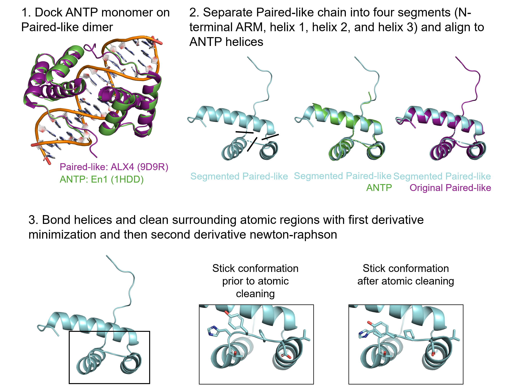
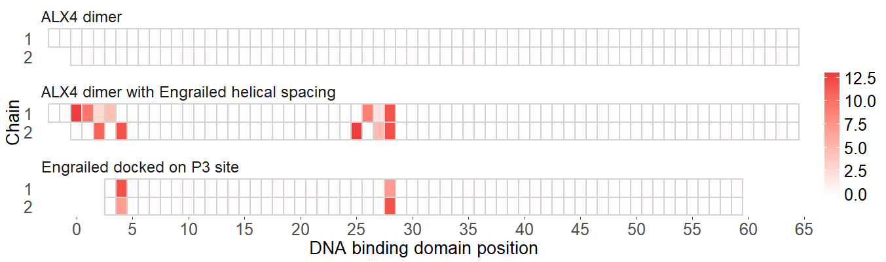

# Scripts associated with Decoding the mechanisms of cooperative DNA binding by the Paired-like homeodomain family manuscript

## Quick links for easy navigation
1. [Sequence constraint comparisons of the Paired-like and ANTP classes](#Sequence-constraint-comparisons-of-the-Paired-like-and-ANTP-classes)
2. [Alpha carbon distance calculations for Paired-like and ANTP published crystal structures](#alpha-carbon-distance-calculations-for-paired-like-and-antp-published-crystal-structures)
3. [Steric clashing analysis](#steric-clashing-analysis)

## Sequence constraint comparisons of the Paired-like and ANTP classes

### [Paired-like_classification_092325.rmd](Paired-like_classification_092325.rmd) generates the following:

* Euclidian distance calculations
* Differential bit information maps
* Residue type breakdowns at position 26, 28, 46, and 44
* Plots denoting number of residues that conflict with P3 site cooperativity for all Paired-like and ANTP factors.

### Required annotation files for script

* [DBD_information.xlsx](DBD_information.xlsx): DNA binding domain annotation for all factors associated with the term homeodomain from [Uniprot](https://www.uniprot.org/).

* [All_HDs.fasta](All_HDs.fasta): Sequences for factors associated with the term homeodomain in [Uniprot](https://www.uniprot.org/).

* [CISBP_HDs.csv](CISBP_HDs.csv): All annotated homeodomain transcription factors in [CISBP](http://cisbp.ccbr.utoronto.ca/).

* [Family_annotation.xlsx](Family_annotation.xlsx): Homeodomain family annotation. 

### Usage 

```bash
git clone --recursive https://github.com/cainbn97/PairedLikeCooperativity
```


See [Paired-like_classification_092325.rmd](Paired-like_classification_092325.rmd]) for the script and [Paired-like_classification_092325.html](Paired-like_classification_092325.html]) for the knitted html file.

All package dependencies can be found at the Session Info section of [Paired-like_classification_092325.html](Paired-like_classification_092325.html]). 


</br> </br>

## Alpha carbon distance calculations for Paired-like and ANTP published crystal structures

These scripts were used to calculate the alpha carbon distance calculations shown in Figure 5D and E.
	
### [DistanceCalculator.py](DistanceCalculator.py) is a PYMOL script that calculates pairwise distances of residues 1 through 60 of chain A of an opened PYMOL object

#### Usage:

1. Obtain necessary scripts

```bash
git clone --recursive https://github.com/cainbn97/PairedLikeCooperativity
```

2. Open protein of interest in PYMOL

3. If necessary, change residue numbering so DNA binding domain is numbered 1 through 60. Example below where N equals difference between current and desired numbering.

```python
alter (all),resi=str(int(resi)+N)
```

4. If necessary, change chain of interest to Chain A. Example below.

```python
alter (chain B),chain='A'
```

5. In PYMOL, select File >> Run Script >> select [DistanceCalculator.py](DistanceCalculator.py)

</br>

See [9d9v_MainChainDistance.txt](MainChainDistanceCalculations/9d9v_MainChainDistanceMatrix.txt) for expected output example. 

</br>

### [ViewPointCreator.py](ViewPointCreator.py) is a PYMOL script that renders viewpoints of key helix to helix pairings of an opened PYMOL object and exports as pngs. 


#### Usage:

Follow steps 1-4 from above. 

5. In PYMOL, select File >> Run Script >> select [ViewPointCreator.py](ViewPointCreator.py)

#### Expected example output:

Helix 1 and helix 2


Helix 2 and helix 3


Helix 1 and helix 3


</br>

### [DistanceAnalysis.R](DistanceAnalysis.R) is an R script that analyzes the text files exported from [DistanceCalculator.py](DistanceCalculator.py). 

#### Usage: 

Run script within the working directory that contains the exported distances matrices. All matrices should have *MainChainDistanceMatrix.txt* within the file name. 

Distance matrices used in manuscript are provided in [MainChainDistanceCalculations](MainChainDistanceCalculations).

#### Expected output: 

Alpha carbon distances for key helical pairings


</br>

Alpha carbon distances differences between Paired-like and ANTP classes


## Steric clashing analysis

These scripts calculated the surface area overlap in angstroms squared for ALX4 (PDB ID: 9D9R), ALX4 modeled with the helical spacing of Engrailed (combination of PDB ID: 9D9R and 1HDD), and Engrailed (PDB ID: 1HDD).

### [AlterHelicalSpacing.py](AlterHelicalSpacing.py)

This script takes two homeodomain PYMOL objects labeled 1-60 and sets the helical spacing of the first PYMOL object to that of the second PYMOL object. 

1. Align PYMOL objects

2. Segment object 1 to generate objects for each helix and the N-terminal ARM

	* N-terminal ARM: 1-8

	* Helix 1: 9-25

	* Helix 2: 26-39

	* Helix 3: 40-60

3. Align each of object's 1 segments with object 2

4. Generate bonds to re-fuse object 1 into single object 

5. Clean newly bonded regions using the first derivative minimization and the second derivative Newton-Raphson algorithm. The below regions were cleaned.

	* N-terminal ARM to helix 1: 7-10

	* Helix 1 to helix 2: 24-27

	* Helix 2 to helix 3: 38-41

6. Exports cif file of new PYMOL object `{OBJECT1}w{OBJECT2}_helicalSpacing.cif`

</br>



#### Usage: 

1. Load two PYMOL objects

2. In line 8 of the script, set the name of the object that you wish to alter the helical spacing to Prd

3. In line 9 of the script, set the name of the object that you wish to use as a helical spacing reference to ANTP

4. In PYMOL, select File >> Run Script >> select [AlterHelicalSpacing.py](AlterHelicalSpacing.py)

</br>

### [StericOverlapCalculator.py](StericOverlapCalculator.py) 

PYMOL automatically ignores clashing regions if they are within the same object. To avoid this, the following steps were taken for each pairwise combination across two proteins (intramolecular steric clash is not calculated): 

1. Each residue is made into its own object

2. The surface area of the residue is calculated with get_area

3. An object is created containing both residues

4. The combined surface area of both residues is calculated with get_area

5. The estimated overlapping area is (Residue 1 area + Residue 2 area - combined area)

6. Estimated areas are exported as file `ResidueOverlap.txt`.

#### Usage: 

Load PYMOL structure with two and only two protein chains. All other objects including nucleic acids will be ignored. 

In PYMOL, select File >> Run Script >> select [StericOverlapCalculator.py](StericOverlapCalculator.py)

*This script will take a few minutes to run. Do not attempt to perform other PYMOL functions until you see 'DONE' print in the console.* 

#### Expected output: 

A matrix containing all pairwise combinations. Rows correspond with chain 1 and columns correspond with chain 2. Number of entries should correspond with length(chainA) x length(chainB). 

Example outputs are shown in [StericOverlapCalculations](StericOverlapCalculations)

</br>

### [OverlapCalculationPlotter.R](OverlapCalculationPlotter.R) 

This script takes matrices from [StericOverlapCalculator.py](StericOverlapCalculator.py) and plots the overlap. This script is specific to the files given in [StericOverlapCalculations](StericOverlapCalculations) and was not written to be applicable to other datasets without modification.

#### Expected output: 


