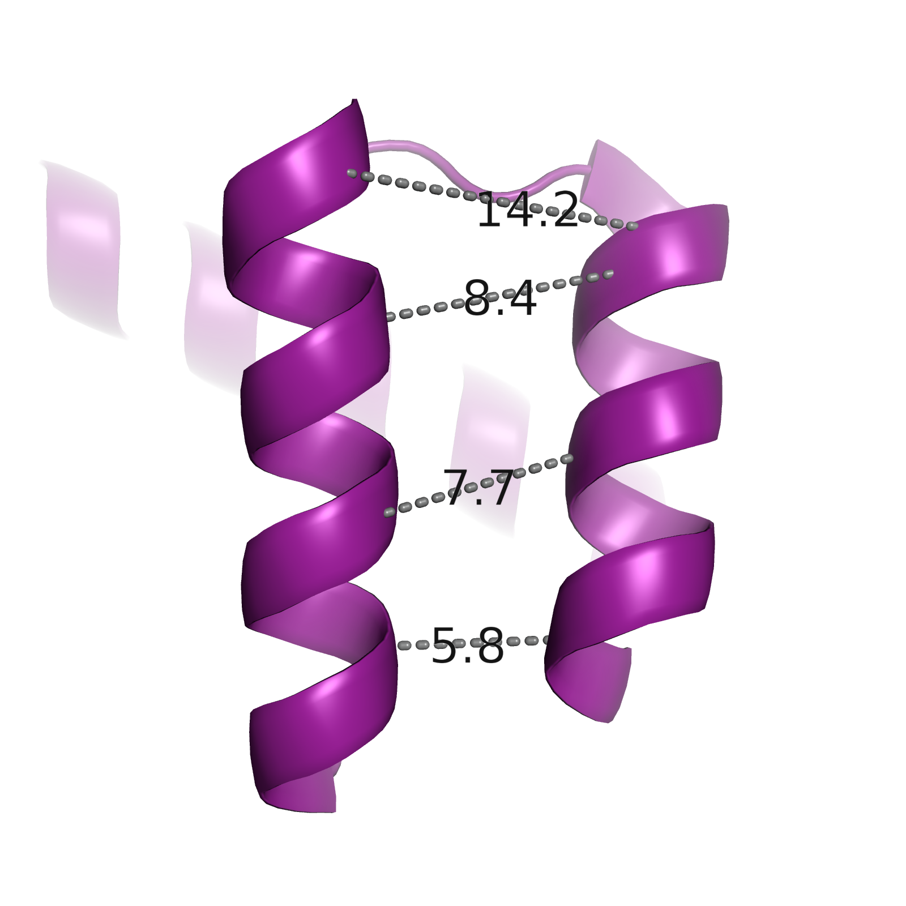
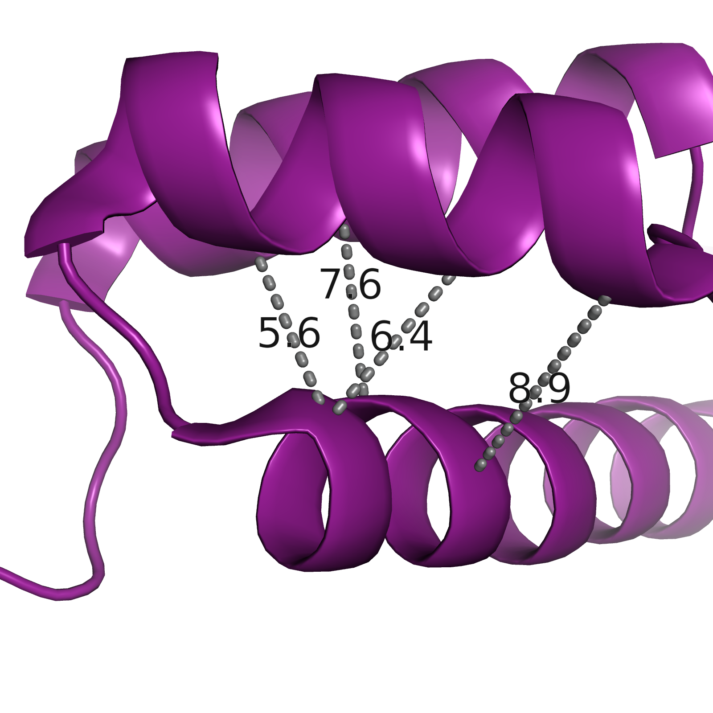
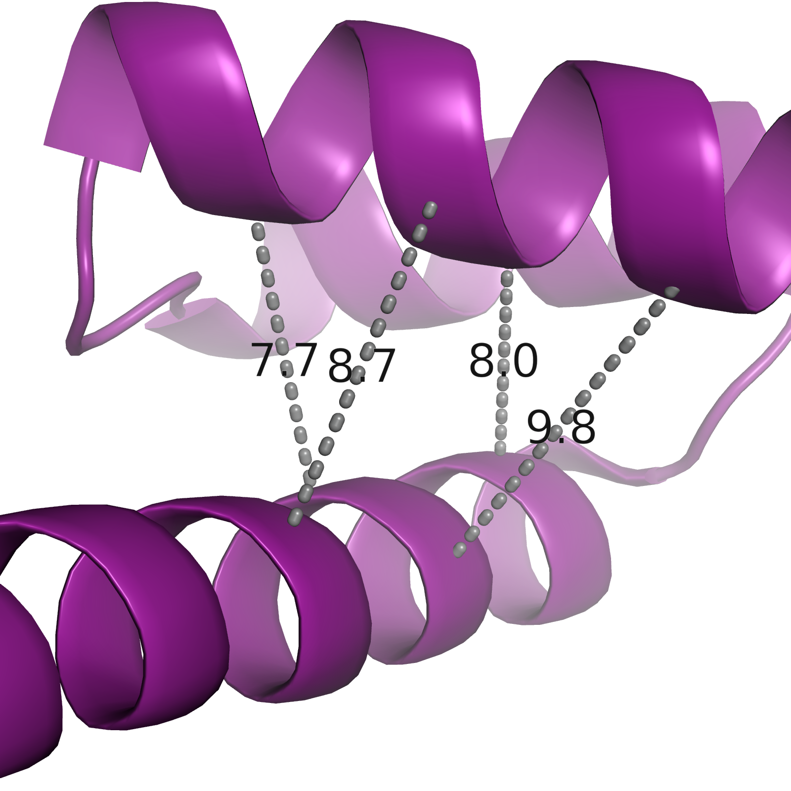
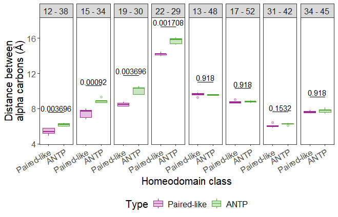
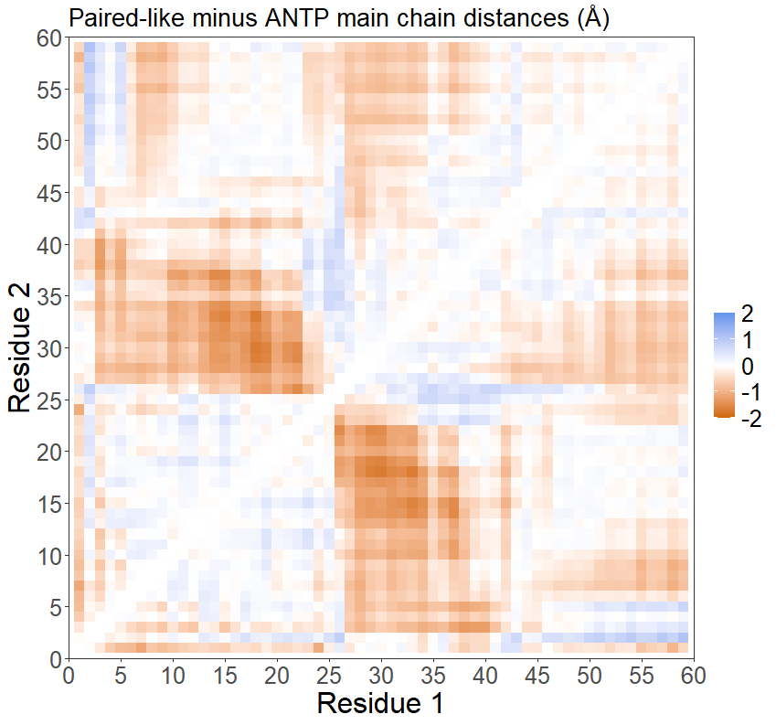

# Scripts associated with Decoding the mechanisms of cooperative DNA binding by the Paired-like homeodomain family manuscript

## Quick links for easy navigation
1. [Sequence constraint comparisons of the Paired-like and ANTP classes](#Sequence-constraint-comparisons-of-the-Paired-like-and-ANTP-classes)
2. [Alpha carbon distance calculations for Paired-like and ANTP published crystal structures](#alpha-carbon-distance-calculations-for-paired-like-and-antp-published-crystal-structures)

## Sequence constraint comparisons of the Paired-like and ANTP classes

### [Paired-like_classification_092325.rmd](Paired-like_classification_092325.rmd]) generates the following:

* Euclidian distance calculations
* Differential bit information maps
* Residue type breakdowns at position 26, 28, and 44
* Plots denoting number of residues that conflict with P3 site cooperativity for all Paired-like and ANTP factors.

### Required annotation files for script

* [DBD_information.xlsx](DBD_information.xlsx): DNA binding domain annotation for all factors associated with the term homeodomain from [Uniprot](https://www.uniprot.org/).

* [All_HDs.fasta](All_HDs.fasta): Sequences for factors associated with the term homeodomain in [Uniprot](https://www.uniprot.org/).

* [CISBP_HDs.csv](CISBP_HDs.csv): All annotated homeodomain transcription factors in [CISBP](http://cisbp.ccbr.utoronto.ca/).

* [Family_annotation.xlsx](Family_annotation.xlsx): Homeodomain family annotation. 

### Usage 

```bash
git clone --recursive https://github.com/cainbn97/PairedLikeCooperativity
```


See [Paired-like_classification_092325.rmd](Paired-like_classification_092325.rmd]) for the script and [Paired-like_classification_092325.html](Paired-like_classification_092325.html]) for the knitted html file.

All package dependencies can be found at the Session Info section of [Paired-like_classification_092325.html](Paired-like_classification_092325.html]). 


</br> </br>

## Alpha carbon distance calculations for Paired-like and ANTP published crystal structures
	
### [DistanceCalculator.py](DistanceCalculator.py) is a PYMOL script that calculates pairwise distances of residues 1 through 60 of chain A of an opened PYMOL object

#### Usage:

1. Obtain necessary scripts

```bash
git clone --recursive https://github.com/cainbn97/PairedLikeCooperativity
```

2. Open protein of interest in PYMOL

3. If necessary, change residue numbering so DNA binding domain is numbered 1 through 60. Example below where N equals difference between current and desired numbering.

```python
alter (all),resi=str(int(resi)+N)
```

4. If necessary, change chain of interest to Chain A. Example below.

```python
alter (chain B),chain='A'
```

5. In PYMOL, select File >> Run Script >> select [DistanceCalculator.py](DistanceCalculator.py)

</br>

See [9d9v_MainChainDistance.txt](MainChainDistanceCalculations/9d9v_MainChainDistanceMatrix.txt) for expected output example. 

</br>

### [ViewPointCreator.py](ViewPointCreator.py) is a PYMOL script that renders viewpoints of key helix to helix pairings of an opened PYMOL object and exports as pngs. 


#### Usage:

Follow steps 1-4 from above. 

5. In PYMOL, select File >> Run Script >> select [ViewPointCreator.py](ViewPointCreator.py)

#### Expected example output:

Helix 1 and helix 2

{width = 20%}

Helix 2 and helix 3

{width = 20%}


Helix 1 and helix 3

{width = 20%}


</br>

### [DistanceAnalysis.R](DistanceAnalysis.R) is an R script that analyzes the text files exported from [DistanceCalculator.py](DistanceCalculator.py). 

#### Usage: 

Run script within the working directory that contains the exported distances matrices. All matrices should have *MainChainDistanceMatrix.txt* within the file name. 

Distance matrices used in manuscript are provided in [MainChainDistanceCalculations](MainChainDistanceCalculations).

#### Expected output: 

Alpha carbon distances for key helical pairings



</br>

Alpha carbon distances differences between Paired-like and ANTP classes

{width 80%}


